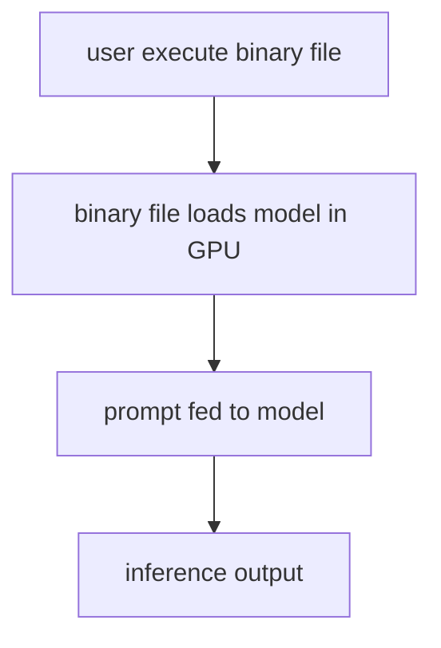

### Objective

Load Llama2 model on Cuda enabled GPU, and do the inference using Kalosm Crate

### Demo On the Terminal


### Wait a Minute.. Model is loading...

##### Repo & Crates References

- [floneum/interfaces/kalosm at main · floneum/floneum · GitHub](https://github.com/floneum/floneum/tree/main/interfaces/kalosm)

### Pre-Reqs

- Ubuntu Linux with Cuda Libraries & Nvidia Drivers
  
  - Refer [how to setup here](https://medium.com/@kamaljp/list/rust-in-linux-with-cuda-llm-703a8526d1fe)

- Following Linux libraries to be installed
  
  ```shell
  sudo apt install libclang-dev
  * export LIBCLANG_PATH=/usr/lib/llvm-<version>/lib
  
  sudo apt-get install librocksdb-dev
  * export ROCKSDB_LIB_DIR=/path/to/rocksdb/lib
  * export ROCKSDB_INCLUDE_DIR=/path/to/rocksdb/include
  ```

- Update the Cargo.toml file with kalosm with "full" and "cuda" features. Refer the [toml file here](https://github.com/Kamalabot/cratesploring/tree/main/floneum_explorer/next-gen-ai)

### Code WalkThrough

1) Imports & Flags

2) Setting up Model

3) Taking User input

4) Generating to Standard Output

### Build Compilation

1. cargo clean 

2. cargo build --bin next-gen-ai
   
   - Creates the binary in /target/debug

### Execution

1. cargo run --bin ../target/debug/next-gen-ai


